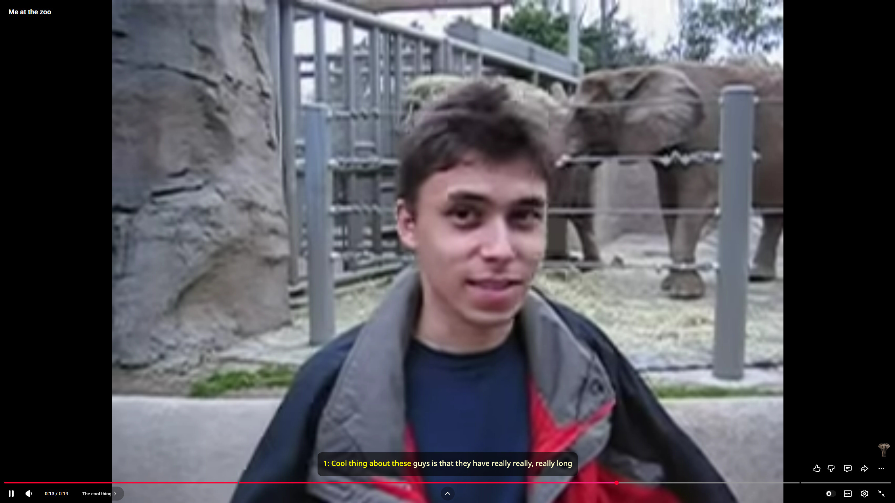

# Omni-STT

Real-time subtitles over everything, from your speakers or your microphone.



Omni-STT listens to sound - what your speakers are playing, what your
microphone hears, or several of those at once - recognizes the speech and draws
it as subtitles on top of whatever is on screen. The overlay is transparent and
click-through, so it sits over a video, a game or a call without getting in the
way of either.

Useful when the audio is bad, when the room is loud, when the speaker is hard to
follow, or any time you would rather read than listen.

## Install

Grab a build from the [Releases page](https://github.com/eoftgge/omni_stt/releases)
and run it. There is no installer - the binary is self-contained, put it wherever
you like.

Antivirus software sometimes flags it, because drawing a click-through window on
top of everything is also what screen-capture malware does. Nothing can be done
about that from this side.

## First run

1. Open **Settings → Speech Engine** and pick a provider. Soniox needs an API
   key and works immediately; Vosk needs a download and works offline. Details
   below.
2. Open **Settings → Audio** and tick what to listen to. Nothing ticked means
   your default output device, which is usually what you want.
3. Close settings. Subtitles appear when someone starts talking.

The tray icon brings settings back and closes the app.

## Audio sources

The list in **Settings → Audio** shows every device the system has, grouped into
**System audio** - what a device is playing - and **Microphone** - what it
hears. Tick as many as you like; they are mixed together and recognized as one
stream.

Two useful combinations:

**Your microphone plus system audio.** In a call, the other people come through
your speakers, and you go into your microphone, so ticking both transcribes the
whole conversation rather than half of it. Wear headphones - otherwise your
microphone picks up the speakers as well and every remote phrase is transcribed
twice, a beat apart.

**A virtual audio cable.** Route one application (a voice chat, say) to a
virtual cable such as VB-Cable or VoiceMeeter, and tick only that cable. The
recognizer then hears voices and nothing else - no game audio, no music, no
notification sounds. This is by far the best transcription quality you can get,
and as a bonus the silences between phrases are real silences, so nothing is
sent to a paid provider while nobody is speaking.

If you route audio to a cable you will stop hearing it yourself; send it back to
your headphones with VoiceMeeter, or with *Listen to this device* on the cable's
recording side. If you do the latter, leave your headphones **unticked** - they
now carry the same audio as the cable, and ticking both transcribes everything
twice.

On Windows and Linux, system audio capture works without extra software — on
Linux, pick the PulseAudio monitor source, which shows up in the **Microphone**
group. macOS has no built-in loopback at all and needs a virtual device such as
BlackHole; that route is untested.

## Speech engines

**Soniox**: cloud recognition, accurate, and the only one of the two that
labels who is speaking and can translate as it goes. Needs an API key, which is
kept in the operating system's keychain (Windows Credential Manager, macOS
Keychain, Linux Secret Service) and never written to the config file. Audio
leaves your machine.

**Vosk**: runs entirely on your computer. No account, no network, nothing
leaves the machine. Less accurate, and no speaker labels. The engine and the
language model are not bundled - together they are hundreds of megabytes, and
most people only ever use one of the two providers.

### Setting up Vosk

Two downloads. Settings tells you whether it found each of them.

1. **The engine library.** Take the build for your platform from the
   [Vosk releases](https://github.com/alphacep/vosk-api/releases) and unpack it.
   Put `libvosk` next to the Omni-STT executable, or point at it in
   *Settings → Speech Engine → Library*. On Windows keep the `libgcc`,
   `libstdc++` and `libwinpthread` DLLs from the same archive beside it
   `libvosk.dll` will not load without them.

2. **A language model.** Pick one from the
   [model list](https://alphacephei.com/vosk/models) and unpack it. Point at the
   unpacked folder - the one containing `am/` and `conf/` - in
   *Settings → Speech Engine → Model*.

Models run from about 50 MB to well over a gigabyte. The small ones load in
seconds and are usually enough for live subtitles.

## Saving transcripts

Turn on **Settings → General → Save transcripts** and every finished line is
appended to `transcripts/omni-YYYY-MM-DD.txt` next to the executable, with the
time of day and the speaker where the provider gives one:

```
=== 2026-09-22 14:03 ===
14:03:17  [1] hey, can you hear me?
14:03:24  [2] yes, you're fine
14:03:31  [1] then let's start
```

A new file per day, in your local time. Plain text, so grep works.

## Settings worth explaining

Most of the settings say what they do. Three do not:

**Threshold** is how loud sound has to be before it counts as speech. Below it,
audio is dropped and never sent anywhere, which saves money on a paid provider
and keeps stale subtitles from lingering. Too high and quiet speech is ignored;
too low and background noise keeps the stream permanently awake. A microphone
usually needs a lower value than system audio.

**Hangover Chunks** is how long the stream stays open after the sound drops
below the threshold, so a pause mid-sentence does not cut the phrase in half.

**Max Blocks** is how many blocks can the current overlay contain. One block is one speaker.

**Max Lines** is how many lines can a single block consist of.

## Building from source

Needs the [Rust toolchain](https://rust-lang.org/tools/install/). Linux also
needs ALSA, GTK 3 and libxdo development packages, see the `apt` list in
`.github/workflows/rust.yml` for the exact names.

```commandline
git clone https://github.com/eoftgge/omni_stt.git
cd omni_stt
cargo build --release
```

The binary lands in `target/release/`.

## Licence

MIT, see [LICENSE](LICENSE). Bundled fonts and dependencies have their own
terms, listed in [THIRD-PARTY-NOTICES.md](THIRD-PARTY-NOTICES.md).

## Problems

Open an [issue](https://github.com/eoftgge/omni_stt/issues). Attaching
`logs/omni.log` (turn on **Settings → General → Log to file** first) saves a
round of questions.
